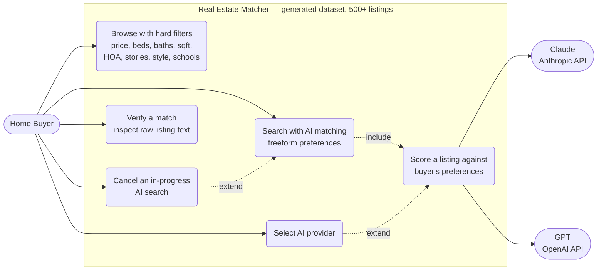
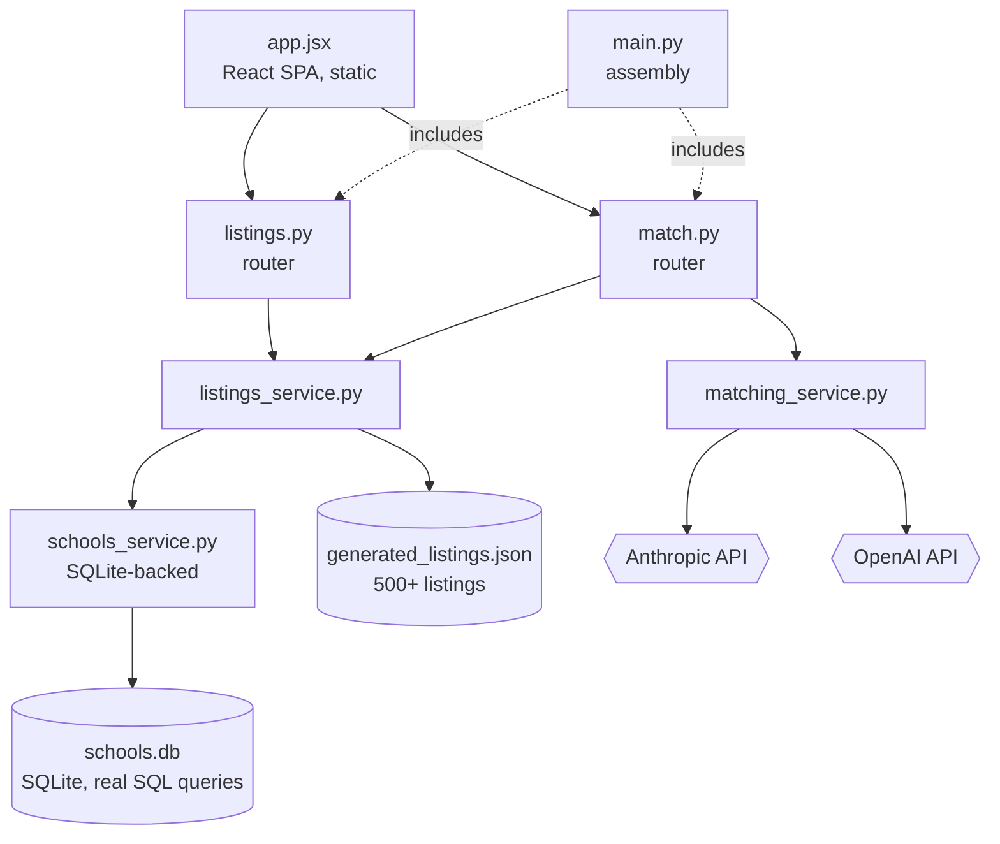
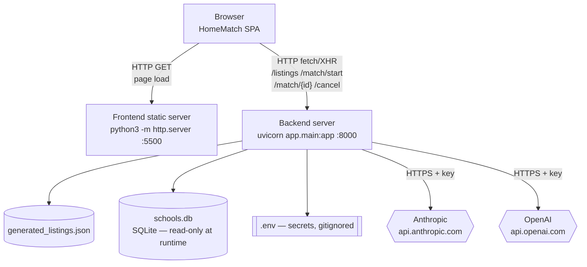
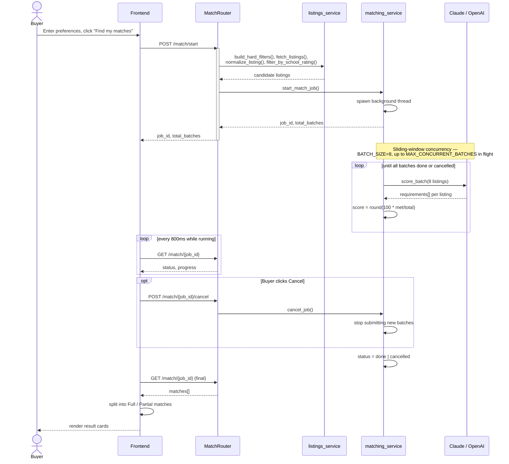

# Real Estate Matcher — SQLite Variant — Architecture Document

**Scope:** this document covers the SQLite variant of the project — identical
to the main app except school ratings are stored in a real SQLite database
(`app/data/schools.db`) instead of `schools.json`. Covers the `generated`
data source (500+ synthetic listings) specifically.

Diagrams are [Mermaid](https://mermaid.js.org) — they render natively when
this file is viewed on GitHub, GitLab, and most modern markdown viewers.
Standalone `.mmd` source files are also in `mermaid/` if you want to drop
one into the [Mermaid Live Editor](https://mermaid.live) directly.

**Only two views actually changed** from the main project's architecture
doc — Logical View and Physical View, both reflecting the schools.json →
schools.db swap. Use-Case View, the Sequence Diagram, and Security View are
identical, since none of them depend on how school data happens to be
stored.

---

## 1. Use-Case View

---

## 2. Logical View

**The change from the main project:** `schools_service.py` is SQLite-backed
— it runs real SQL queries against `schools.db` instead of parsing
`schools.json` into memory on every startup. Everything else calling it
(`listings_service.py`, and transitively the routers) is unchanged — the
public interface (`lookup_school()`, `attach_school_ratings()`) is
identical either way.

---

## 3. Physical View

**The change:** `schools.db` replaces `schools.json` as a physical file on
disk. It's built once by `scripts/seed_schools_db.py` and committed to the
repo — nothing writes to it at runtime.

**Why `schools.db` is safe on hosts with an ephemeral filesystem** (e.g.
Render's free tier, which wipes local file changes on every redeploy,
restart, or spin-down): it's **read-only at runtime**. Nothing in the app
ever writes to it after `seed_schools_db.py` builds it — it's committed to
the repo and rebuilt fresh on every deploy, the same way
`generated_listings.json` already is. This is a fundamentally different
situation from a runtime cache or search history, which *would* break on
this kind of host — see the main project's deployment notes for why that
distinction mattered when we considered and rejected a caching feature
earlier.

---

## 4. Sequence Diagram — AI-Matching a Search

Unchanged from the main project — school rating lookups happen inside
`listings_service.py`'s `filter_by_school_rating()` step, which internally
now hits SQLite instead of JSON, but the request/response flow at this
level of detail is identical either way.

---

## 5. Security View

Unchanged from the main project — this variant doesn't touch
authentication, CORS, secrets handling, or input validation at all.

```mermaid
flowchart LR
    subgraph Untrusted["Untrusted zone"]
        Browser["Browser / SPA"]
    end

    subgraph Trusted["Trusted zone — server process"]
        API["FastAPI app"]
        Validators["Pydantic validators"]
        Secrets[".env secrets"]
        Jobs["In-memory job registry"]
    end

    subgraph External["External trusted providers"]
        Anthropic{{"Anthropic API"}}
        OpenAI{{"OpenAI API"}}
    end

    Browser -->|HTTP| API
    API --> Validators
    API --> Secrets
    API --> Jobs
    API -->|"HTTPS + key"| Anthropic
    API -->|"HTTPS + key"| OpenAI

    style Untrusted fill:#2a0f0f,stroke:#CC0000,stroke-width:2px
    style Trusted fill:#0f2412,stroke:#007700,stroke-width:2px
    style External fill:#1e1e1e,stroke:#888888,stroke-width:2px
```

### Security findings, in plain writing

Identical to the main project's — see there for the full table. One
addition specific to this variant:

| # | Finding | Current state |
|---|---|---|
| 7 | **`schools.db` is committed to the repo** | Same as `generated_listings.json` — synthetic, non-sensitive reference data, safe to commit. No secrets or real data stored in it. |
