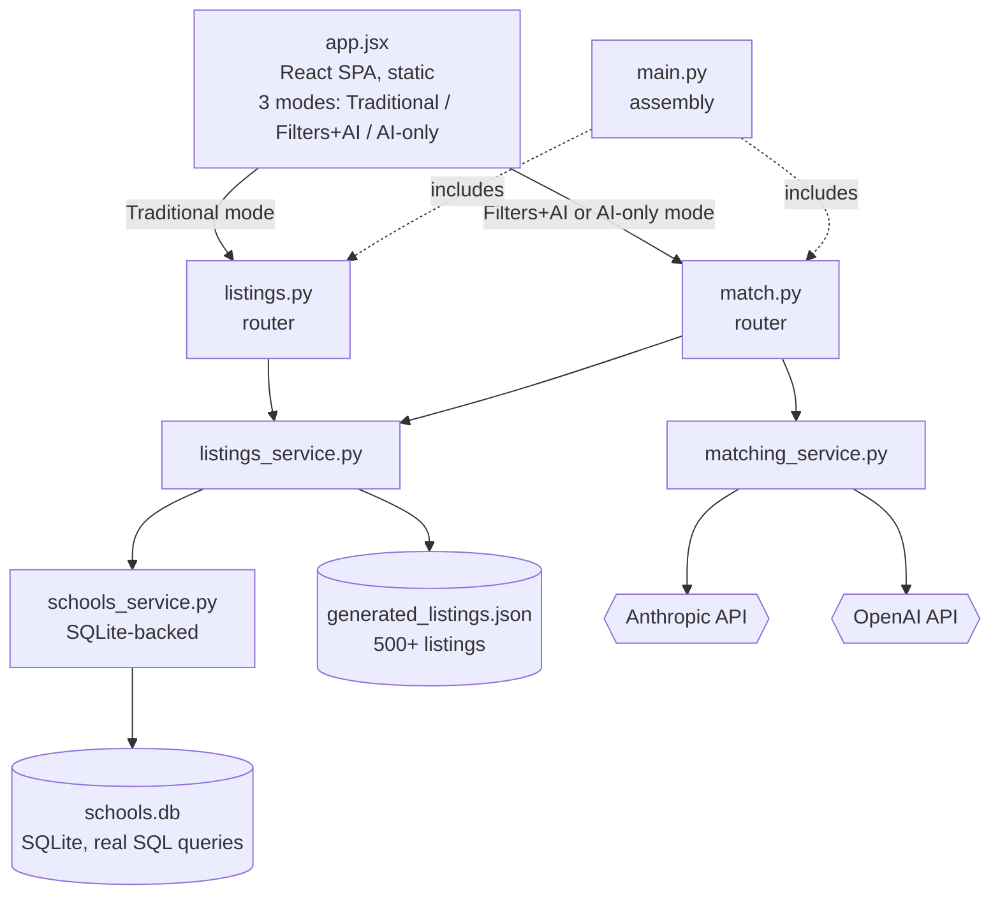
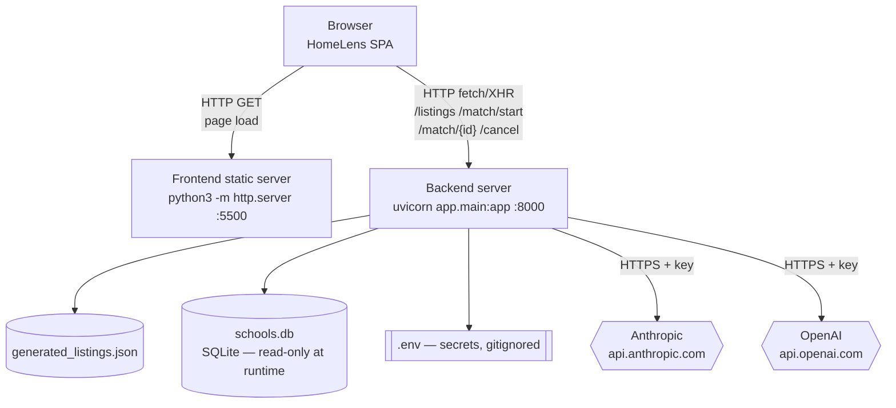
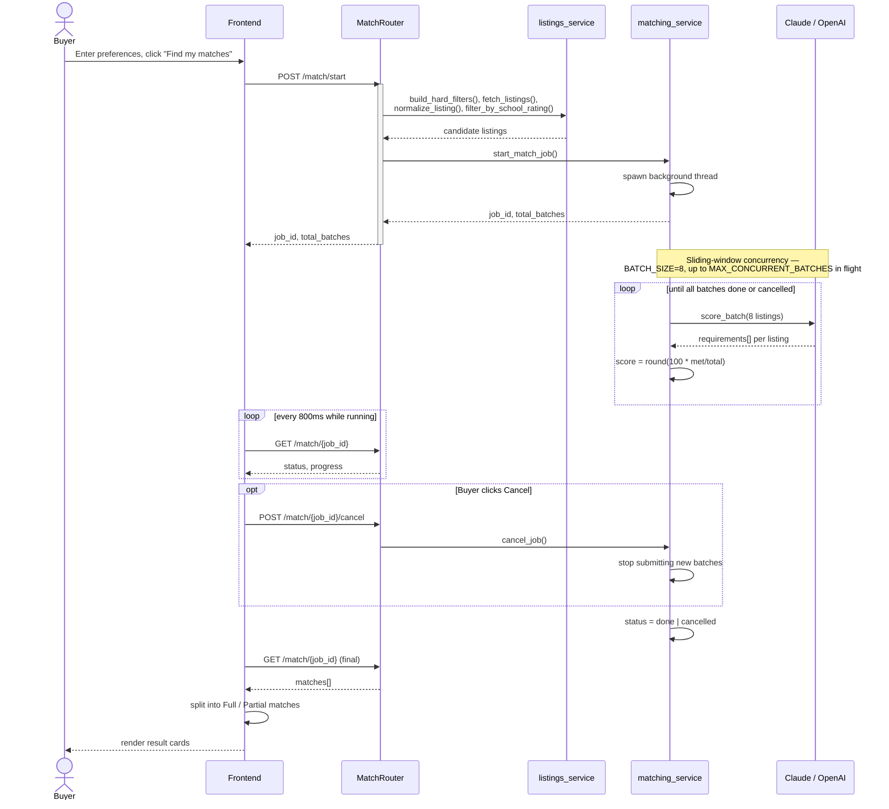
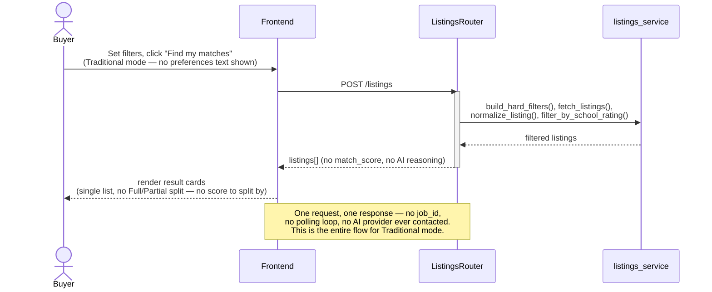
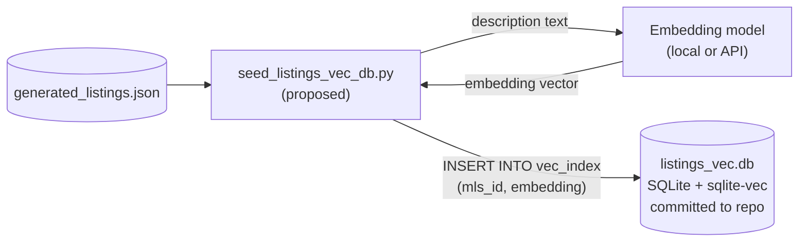
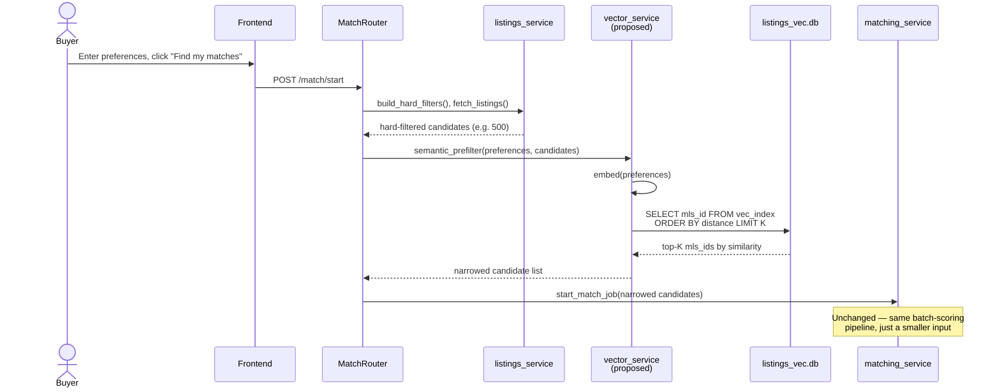
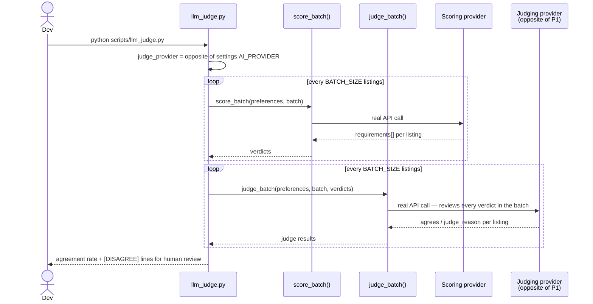

# HomeLens — Architecture

**Scope:** the SQLite variant — school ratings live in a real SQLite
database (`app/data/schools.db`) rather than a parsed JSON file — running
against the `generated` data source (500+ synthetic listings, Redwood City).

The frontend offers three explicit search modes:
- **Traditional** — hard filters only, zero AI involvement
- **Filters + AI** — hard filters narrow the pool, then AI scores what's left
- **AI only** — pure natural language, zero hard filters

Diagrams are [Mermaid](https://mermaid.js.org) — render natively on GitHub,
GitLab, and most modern markdown viewers. Standalone `.mmd` files are in
`diagrams/` for [mermaid.live](https://mermaid.live).

---

## 1. Use-Case View

Traditional mode has no relationship to Cancel (UC4): it's a single, quick
synchronous request with no background job to cancel. Only the two
AI-using modes run as cancellable jobs.

---

## 2. Logical View

Both AI-using modes route through the same `MatchRouter`, differing only
in which filter values get sent — AI-only always sends every filter as
`null`. `ListingsRouter` never imports `matching_service`, so Traditional
mode structurally cannot contact either AI provider.

---

## 3. Physical View

---

## 4a. Sequence Diagram — Filters + AI / AI-only Search

Both AI-using modes share this exact flow — they differ only in which
filter values are sent (AI-only always sends every filter as `null`).

## 4b. Sequence Diagram — Traditional Search

Synchronous, no background job, no AI provider contacted at all.

---

## 5. Security View

```mermaid
flowchart LR
    subgraph Untrusted["Untrusted zone"]
        Browser["Browser / SPA"]
    end

    subgraph Trusted["Trusted zone — server process"]
        API["FastAPI app"]
        Validators["Pydantic validators"]
        Secrets[".env secrets"]
        Jobs["In-memory job registry"]
    end

    subgraph External["External trusted providers"]
        Anthropic{{"Anthropic API"}}
        OpenAI{{"OpenAI API"}}
    end

    Browser -->|HTTP| API
    API --> Validators
    API --> Secrets
    API --> Jobs
    API -->|"HTTPS + key<br/>(Filters+AI / AI-only modes only)"| Anthropic
    API -->|"HTTPS + key<br/>(Filters+AI / AI-only modes only)"| OpenAI

    style Untrusted fill:#2a0f0f,stroke:#CC0000,stroke-width:2px
    style Trusted fill:#0f2412,stroke:#007700,stroke-width:2px
    style External fill:#1e1e1e,stroke:#888888,stroke-width:2px
```

| # | Finding | Current state |
|---|---|---|
| 1 | No authentication on any endpoint | Zero auth code anywhere in `app/routers/` — anyone reaching the port can trigger real AI API costs or poll/cancel any job by guessing its UUID |
| 2 | CORS defaults to `*` | `CORS_ALLOW_ORIGINS` in `config.py` — any website's JS could call this API from a visitor's browser unless set explicitly |
| 3 | A secret in frontend code is not a real barrier | General principle — anyone can view it via browser DevTools and replay requests directly, bypassing the UI entirely |
| 4 | Secrets handling | `.env` gitignored, never returned in responses, never logged (only usage counts) |
| 5 | Input validation | Every field validated by Pydantic (type, enum membership) — invalid input gets a clean 422 |
| 6 | Data sensitivity | Entirely synthetic — fictional addresses, fictional school names/ratings, no real PII |
| 7 | `schools.db` is committed to the repo | Synthetic, non-sensitive reference data, same category as `generated_listings.json` |
| 8 | Traditional mode has a stronger privacy profile | Never contacts Anthropic or OpenAI — structurally guaranteed, since `ListingsRouter` never imports `matching_service` |

---

## 6. Future Scope — Semantic Retrieval Pre-Filter (`sqlite-vec`)

**Not implemented.**

### The problem it solves

Every listing that survives hard filtering currently gets sent to the LLM
for full per-requirement reasoning (§4a) — for the `generated` dataset,
that's up to 500 listings across ~64 batches, real latency and real cost
per search. A semantic pre-filter would narrow that pool by similarity to
the buyer's preferences *before* the expensive per-requirement scoring
runs, rather than replacing that scoring — most useful in **AI-only
mode**, which has no hard filters to narrow anything today, so the full
dataset always reaches the LLM regardless of query.

### The use case, concretely

Two separate flows: build the index once (offline, on data change), then
query it on every real search.

**Indexing** — run whenever `generated_listings.json` changes, same
trigger as reseeding `schools.db`:

**Query time** — a new stage between hard filtering and AI scoring:

### Rough interface

A new `app/services/vector_service.py`, kept separate from
`matching_service.py` the same way `schools_service.py` is separate from
`listings_service.py` — a distinct data source, its own module:

- `index_listings(listings: list[dict]) -> None` — embeds each listing's
  `description` and writes to `listings_vec.db`. Called by a one-time
  script (`seed_listings_vec_db.py`), not at request time — same shape as
  `seed_schools_db.py`.
- `semantic_prefilter(preferences: str, candidates: list[dict], k: int) -> list[dict]`
  — embeds the buyer's preferences, queries `listings_vec.db` for the
  `k` closest `mls_id`s among the candidates, returns the narrowed list.
  Called from `MatchRouter`, between `fetch_listings()` and
  `start_match_job()`.

Two concrete decisions this would need before any code gets written,
each measured against real data rather than guessed — same "verify
before implementing" habit `analyze_scores.py` already applies to
`SCORE_THRESHOLD`:

- **Which embedding model.** A local sentence-transformers model avoids
  a third API dependency entirely; an API-based embedding model (e.g.
  the same providers already in use) adds one more network call per
  search but needs no local model weights shipped with the repo.
- **The value of `k`.** Too small risks silently dropping a real match
  before the LLM ever sees it — the actual failure mode to check for
  by comparing pre-filtered results against today's full-corpus results
  on the same queries, not by picking a number that sounds reasonable.

### Where this fits, and where it doesn't

`schools.db` already establishes the exact pattern a listings-embedding
index would follow: built once, committed to the repo, queried read-only
at runtime, safe on an ephemeral-filesystem host since nothing ever
writes to it after the build step.

This only fits the `generated` and `realistic` sources, where the data
lives in a file you control — `live` (the real SimplyRETS sandbox) isn't
something you'd pre-build a local index against, since its content can
change day to day.

---

## 7. LLM-as-judge Accuracy Check

`scripts/llm_judge.py` has one AI provider review another provider's real
`score_batch()` verdicts — never part of the live app, nothing in
`app/routers/` or `app/main.py` touches it. Manual dev tool, same
category as `analyze_scores.py` and `verify_test_cases.py`.

**Why this exists, and its real limit.** `verify_test_cases.py`'s Tier 3
already gives real ground truth — every expected answer hand-verified
against the actual text of 14 fixed listings. Its limit is scale, not
method: hand-verifying more than 14 listings across more than 3 narrow
dimensions isn't something to do by hand for every query. A judge model
is not a replacement for that ground truth and isn't inherently more
trustworthy than the model being judged — if scorer and judge share the
same blind spot, they'll agree confidently while both being wrong, and
the judge gives zero signal in that case. What it's actually good for is
**triage**: a shortlist of exactly which verdicts a second model
disagreed with, worth a human look. A disagreement is a prioritization
signal, not proof of an error — a human still makes the final call.

### How it runs

### Provider selection

`AI_PROVIDER` in `.env` picks which provider does the real scoring, same
as it always has. The judge always uses whichever provider that ISN'T —
`anthropic` scored → `openai` judges, and vice versa — chosen
automatically, never something configured separately. Both
`ANTHROPIC_API_KEY` and `OPENAI_API_KEY` need to be set regardless of
which one `AI_PROVIDER` points to; a missing judge key is reported before
any call is made, not partway through a run.

### Batching

Judging happens in the same `BATCH_SIZE`-sized batches scoring already
uses — one judge API call reviews up to 8 listings and returns one
`{mls_id, agrees, judge_reason}` object per listing, the same
per-listing attribution `score_batch` already uses for a shared batch
call. Judging N listings costs `ceil(N/8)` calls, not N.

### Cost, in real call counts

| Scope | Scoring calls | Judge calls | Total |
|---|---|---|---|
| Default — same 14 listings + 3 queries Tier 3 uses | 6 | 6 | **12** |
| `--full-sweep` against `generated` (500 listings), 1 query | 63 | 63 | **126** |
| `--full-sweep --sample 50`, 1 query | 7 | 7 | **14** |

For an exact dollar figure: run with `DEBUG_MODE=true` to log real token
usage, then apply your provider's published per-token rate.

### Every verdict shows real evidence, not a summary

Every `[AGREE]`/`[DISAGREE]` line prints the itemized
`requirement text: MET/NOT MET` breakdown directly underneath, not just
either model's one-sentence account of itself — a summary alone isn't
independently verifiable, the itemized breakdown is. Every run also
writes `scripts/llm_judge_output.csv` (gitignored, regenerated fresh each
run) — every listing, every query, the real description, the full
requirements breakdown, and the judge's verdict, in one row each.

### Feedback loop — `--review`

Few-shot learning from your corrections, not training — no model weights
change for either provider. When `--review` is passed, every `[DISAGREE]`
prompts interactively — `[j] judge was right / [s] scorer was right /
[b] both wrong / [enter] skip`, plus an optional one-line lesson — and
the answer saves to `scripts/judge_feedback.json` immediately. On every
subsequent run (with or without `--review` — the flag only controls
whether new corrections get collected *this* run), the most recent
corrections (capped at `MAX_FEW_SHOT_EXAMPLES = 8`) get folded into the
judge's prompt as worked examples.

`--review` is opt-in because it blocks on `stdin` after every
disagreement — wrong for an unattended or scripted run.

**What this deliberately does not promise:** there's no version of this
where a model self-corrects to zero errors without a human ever checking
in, and the loop itself depends on that review happening. What
realistically improves is the *frequency* of disagreements needing
attention, not the review disappearing.

`--spot-check-agrees N` pulls every Nth `[AGREE]` into the same
interactive review as a real disagreement — agreement between scorer and
judge is not proof either is correct, since a shared blind spot produces
confident agreement while both are wrong, and a disagreement-only review
structurally can never catch that. Off by default; only takes effect
together with `--review`.
