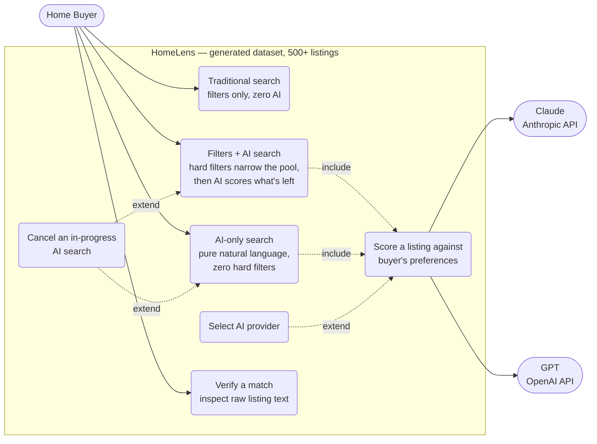
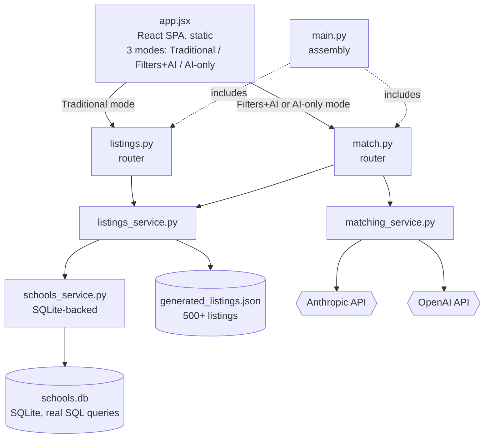
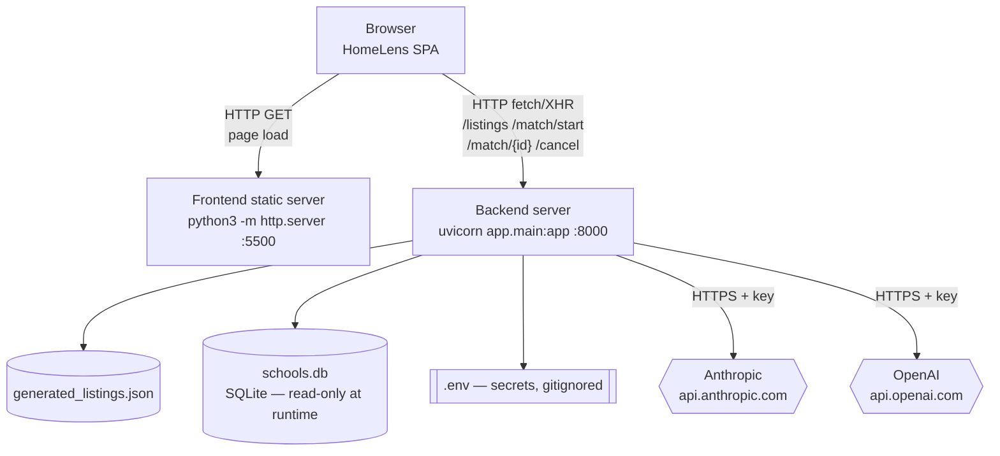
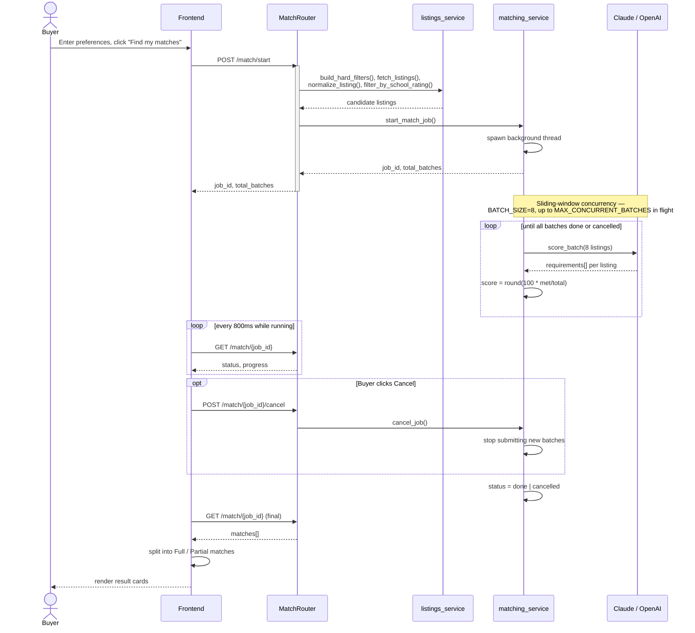
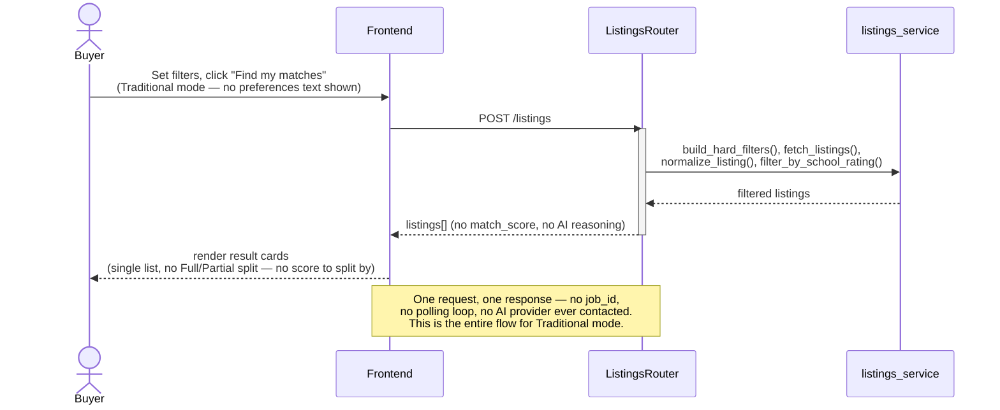
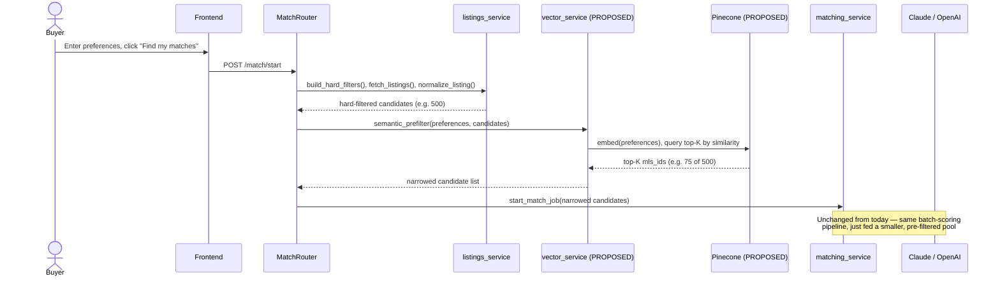
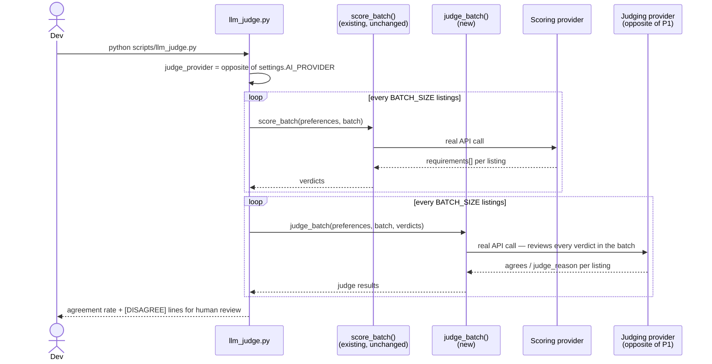

# HomeLens — SQLite Variant — Architecture Document

**Scope:** covers the SQLite variant — school ratings in a real SQLite
database (`app/data/schools.db`) instead of `schools.json` — against the
`generated` data source (500+ synthetic listings, all in Redwood City).

**Reflects the 3-mode search UI**: the frontend now offers three distinct,
explicit search modes instead of one combined form with a "skip AI"
checkbox:
- **Traditional** — hard filters only, zero AI involvement
- **Filters + AI** — hard filters narrow the pool, then AI scores what's left
- **AI only** — pure natural language, zero hard filters

Diagrams are [Mermaid](https://mermaid.js.org) — render natively on GitHub,
GitLab, and most modern markdown viewers. Standalone `.mmd` files are in
`diagrams/` for [mermaid.live](https://mermaid.live).

---

## 1. Use-Case View

**UC1 (Traditional) has no relationship to UC4 (Cancel)** — deliberately.
Traditional mode is a single, quick synchronous request with no background
job to cancel; only the two AI-using modes run as cancellable jobs.

---

## 2. Logical View

**The component graph itself didn't change for the 3-mode UI** — the
backend already supported filter-free search (every `HardFilters` field
defaults to `None`); the new UI just exposes that capability clearly
instead of burying it behind a checkbox. Both AI-using modes route through
the same `MatchRouter`, differing only in which filter values get sent.

---

## 3. Physical View

Unaffected by the 3-mode UI — same routes already covered every mode's
actual traffic.

---

## 4a. Sequence Diagram — Filters + AI / AI-only Search

Both AI-using modes share this exact flow — they differ only in which
filter values are sent (AI-only always sends every filter as `null`).

## 4b. Sequence Diagram — Traditional Search

Genuinely different flow — synchronous, no background job, no AI provider
contacted at all.

---

## 5. Security View

```mermaid
flowchart LR
    subgraph Untrusted["Untrusted zone"]
        Browser["Browser / SPA"]
    end

    subgraph Trusted["Trusted zone — server process"]
        API["FastAPI app"]
        Validators["Pydantic validators"]
        Secrets[".env secrets"]
        Jobs["In-memory job registry"]
    end

    subgraph External["External trusted providers"]
        Anthropic{{"Anthropic API"}}
        OpenAI{{"OpenAI API"}}
    end

    Browser -->|HTTP| API
    API --> Validators
    API --> Secrets
    API --> Jobs
    API -->|"HTTPS + key<br/>(Filters+AI / AI-only modes only)"| Anthropic
    API -->|"HTTPS + key<br/>(Filters+AI / AI-only modes only)"| OpenAI

    style Untrusted fill:#2a0f0f,stroke:#CC0000,stroke-width:2px
    style Trusted fill:#0f2412,stroke:#007700,stroke-width:2px
    style External fill:#1e1e1e,stroke:#888888,stroke-width:2px
```

### Security findings, in plain writing

| # | Finding | Current state | Real risk if deployed publicly, unaddressed |
|---|---|---|---|
| 1 | **No authentication on any endpoint** | Confirmed — zero auth code anywhere in `app/routers/` | Anyone reaching the port can trigger real AI API costs, or poll/cancel any job by guessing its UUID |
| 2 | **CORS defaults to `*`** | `CORS_ALLOW_ORIGINS` defaults to wildcard in `config.py` | Any website's JS could call this API from a visitor's browser |
| 3 | **A secret in frontend code is not a real barrier** | N/A — general principle | Anyone can view it via browser DevTools and replay requests directly, bypassing the UI entirely |
| 4 | **Secrets handling** | `.env` gitignored, never returned in responses, never logged (only usage counts) | Verified correct |
| 5 | **Input validation** | Every field validated by Pydantic (type, enum membership) | Verified correct — invalid input gets a clean 422 |
| 6 | **Data sensitivity** | Entirely synthetic — fictional addresses, fictional school names/ratings | No real PII or real-world claims at risk |
| 7 | **`schools.db` is committed to the repo** | Same as `generated_listings.json` — synthetic, non-sensitive reference data, safe to commit | No secrets or real data stored in it |
| 8 | **Traditional mode has a stronger privacy profile** | Never contacts Anthropic or OpenAI at all — confirmed structurally, not just by convention (`ListingsRouter` never imports `matching_service`) | A buyer using Traditional mode has a real, verifiable guarantee that their search criteria never leaves the server to a third party |

---

## 6. Proposed Enhancement — Semantic Retrieval Pre-Filter (Pinecone or sqlite-vec)

**Status: design discussion only. Nothing in this section is implemented.**
No Pinecone dependency, config, or code exists anywhere in this repo. This
section exists so the idea isn't lost, and so a future session (or another
developer) can pick it up without re-deriving the reasoning from scratch.

### The problem this would solve

Today, every listing that survives hard filtering gets sent to the LLM for
full per-requirement reasoning (§4a) — for the `generated` dataset, that's
up to 500 listings across ~64 batches. The README already documents this
as a real, known cost/latency concern ("60+ calls per search... real
latency and cost, unlike testing against 14 listings") and recommends hard
filters as the mitigation. A semantic pre-filter would be a second lever,
usable even in **AI-only mode**, where there are no hard filters to narrow
anything.

### Where it would sit

A new stage between `listings_service.fetch_listings()` (hard filters) and
`matching_service`'s batch scoring — narrowing the candidate pool by
semantic similarity to the buyer's freeform preferences *before* the
expensive, accurate-but-costly per-requirement LLM scoring runs, rather
than replacing that scoring.

A separate, offline/on-data-change indexing path would embed each
listing's `description` (+ maybe a compact structured summary) and upsert
it into Pinecone with `mls_id` as metadata — this runs once per dataset
change, not per search, similar in spirit to how `seed_schools_db.py`
already runs once per `schools.json` change rather than on every request.

### Why this, specifically, over other options

- **Doesn't touch the accuracy story.** The LLM still reads full listing
  text and does the same honest, per-requirement `met: true/false`
  judgment (§10) — Pinecone only decides *which* listings reach that
  step, never scores anything itself. The "AI reads real listing text
  instead of pattern-matching keywords" claim in §6 of the handoff
  doesn't weaken.
- **Composes with, doesn't replace, hard filters.** Filters + AI mode
  would run hard filters first (as today), then semantic pre-filter the
  survivors. AI-only mode — which today sends the entire dataset to the
  LLM with zero narrowing — is where this would help most.
- **Matches the existing warm-up-batch philosophy.** §9's warm-up batch
  exists purely to make a search feel faster without changing what gets
  scored; a semantic pre-filter is the same instinct applied earlier in
  the pipeline, at real cost savings instead of just perceived latency.

### Honest tradeoffs — why this isn't a clear "yes, build it"

- **A third AI cost line.** An embedding call per listing at index time,
  and one per search at query time — on top of Claude/OpenAI matching
  cost, not instead of it.
- **New external dependency.** A Pinecone account, index, and API key to
  provision and keep secret, alongside Anthropic/OpenAI.
- **The three data sources don't behave the same way here.** `generated`
  (500, static) is the only source where pre-filtering meaningfully pays
  off. `realistic` (14 listings) gains nothing — the whole point of that
  dataset is being small and fixed for ground-truth testing (§13 of the
  handoff's Tier 3 test). `live` (real SimplyRETS sandbox, content can
  change day to day per the README) would need either per-request
  embedding or a scheduled reindex job — real added complexity, not a
  drop-in.
- **Scale mismatch, honestly stated.** Vector retrieval earns its keep at
  thousands+ of listings; at 500, a full-corpus LLM pass is slow-ish and
  costs real money, but isn't actually broken. The genuine justification
  is "this is the architecture you'd want if the real dataset were 10k+
  listings" — a legitimate thing to demonstrate for a POC being
  evaluated on architectural thinking, but worth stating plainly rather
  than implying it solves an urgent problem at current scale.

### Alternative worth naming: `sqlite-vec`

Pinecone remains the primary option sketched above — this doesn't replace
it, just names a lower-commitment alternative for the same retrieval-
pre-filter role. [`sqlite-vec`](https://github.com/asg017/sqlite-vec) is a
free, open-source SQLite extension that adds vector KNN search directly
into SQLite via a virtual table (`CREATE VIRTUAL TABLE vec_index USING
vec0(embedding float[N])`) — no separate server, no account, no API key.

The specific reason this fits *this* project better than a generic "free
vector DB" comparison would suggest: `schools.db` already establishes the
exact pattern a `sqlite-vec` index would follow — built once by
`seed_schools_db.py`, committed to the repo, read-only at runtime,
specifically chosen because it's safe on Render's ephemeral free-tier
filesystem (see the Schools section above). A listing-embeddings index
could follow that identical precedent: built once (or rebuilt whenever
`generated_listings.json` changes, the same trigger as reseeding schools),
committed, queried read-only — zero new infrastructure, zero new secrets,
consistent with the "SQLite for local structured data, no external DB
server" choice already made in this codebase.

The tradeoff going the other way: `sqlite-vec` only makes sense for the
`generated` and `realistic` sources, where the data already lives in a
file you control. `live` (the real SimplyRETS sandbox) doesn't fit this
pattern any better than it fit Pinecone above — a third-party API's
content isn't something you pre-build a local index against.

### If this moves forward

A natural next step, still without writing code, would be sketching the
`vector_service.py` interface (`index_listings()`, `semantic_prefilter()`)
and deciding the top-K cutoff and embedding model as their own explicit
decisions — the same "verify claims against real data before implementing"
pattern already established for this project (handoff §20), applied to
measuring actual score-quality impact of pre-filtering before committing
to a K value, the same way `analyze_scores.py` measures real distributions
before `SCORE_THRESHOLD` gets set. This decision — Pinecone vs.
`sqlite-vec` — is itself part of that sketch, not something to
settle here.

---

## 7. LLM-as-judge Accuracy Check

**Status: implemented** — `scripts/llm_judge.py`. Unlike §6, this one is
real code, not a design sketch.

### The problem it solves — and what it deliberately does NOT solve

`verify_test_cases.py`'s Tier 3 already gives real ground truth: every
expected answer was hand-verified against the actual remarks text of the
14 fixed `realistic_listings.json` listings. Its limit isn't the judging
method, it's scale — hand-verifying more than 14 listings across more than
3 narrow dimensions isn't something to do by hand for every new query.

An LLM judge is **not a replacement for that ground truth** and isn't
inherently more trustworthy than the model being judged — if scorer and
judge share the same blind spot (e.g. both misread "close to Caltrain"
identically), they'll agree confidently while both being wrong, and the
judge gives zero signal in that case. What it's actually good for is
**triage at scale**: turning "read every listing yourself to catch a bad
verdict" into "read the handful the judge flagged as disagreements." A
disagreement is a prioritization signal for where a human should look
next, not proof of an error — the human (you) still makes the final call,
exactly as already happens for Tier 3.

### How it runs

**Implementation note:** the judge payload is supposed to carry each
listing's itemized `requirements` breakdown (`[{"text": ..., "met":
bool}, ...]`) alongside the free-text `reason`, not just the reason
alone — that's what actually lets the judge (and a human, in `--review`)
check a specific claim against specific evidence instead of evaluating a
one-sentence summary. This didn't work correctly at first:
`_compute_deterministic_scores()` in `matching_service.py` computed
`requirements_total`/`requirements_met` *counts* from the itemized list
but never included the list itself in what `score_batch()` returns, so
`_build_judge_payload()`'s `verdict.get("requirements", [])` was silently
always `[]`. Fixed by adding the `requirements` key to that return value —
purely additive, since `_merge_and_rank()` (the live app's own consumer of
`score_batch`) only reads specific keys it already expects and ignores
anything extra, so this couldn't affect real search results even before
being caught.

Never runs as part of the live app — nothing in `app/routers/` or
`app/main.py` touches this. It's a manual dev tool, the same category as
`analyze_scores.py` and `verify_test_cases.py`, run from the command line.

### Provider selection — automatic, always the opposite

`AI_PROVIDER` in `.env` picks which provider does the real scoring, same
as it always has. The judge always uses whichever provider that ISN'T —
`anthropic` scored → `openai` judges, and vice versa — chosen automatically
by `_opposite_provider()`, never something you configure separately. Both
`ANTHROPIC_API_KEY` and `OPENAI_API_KEY` need to be set for this script to
run regardless of which one `AI_PROVIDER` points to; if the judge's key is
missing, the script says exactly that and exits before making any call,
rather than failing partway through a run.

### Batching — the design choice that keeps this cheap

Judging happens in the same `BATCH_SIZE`-sized batches scoring already
uses — a single judge API call reviews up to 8 listings at once and
returns one `{mls_id, agrees, judge_reason}` object per listing, same
attribution pattern `score_batch` already uses for multiple listings
sharing one call. Judging N listings costs `ceil(N/8)` calls, not N —
reviewing 14 listings costs 2 judge calls, not 14.

### Cost, in real call counts

| Scope | Scoring calls | Judge calls | Total |
|---|---|---|---|
| Default (`llm_judge.py`) — same 14 listings + 3 queries Tier 3 uses | 6 | 6 | **12** |
| `--full-sweep` against `generated` (500 listings), 1 query | 63 | 63 | **126** |
| `--full-sweep --sample 50`, 1 query | 7 | 7 | **14** |

For an exact dollar figure rather than a call count: run with
`DEBUG_MODE=true` (§ above) to log real token usage, then apply your
provider's published per-token rate for whichever models you're running —
deliberately not estimated here, since per-token pricing varies by model
and stating a number with false precision would be worse than not stating
one.

### Feedback loop — `--review`, few-shot, not training

**Status: implemented.** An opt-in flag that lets a human correction
actually shape future judge calls, without overclaiming what that means.

**What this is: few-shot learning from your corrections, not training.**
No model weights change — there's no access path to that for either
provider (see the RL discussion this grew out of). What happens instead:
when `--review` is passed, every `[DISAGREE]` prompts you interactively —
`[j] judge was right / [s] scorer was right / [b] both wrong / [enter]
skip`, plus an optional one-line lesson — and the answer is saved to
`scripts/judge_feedback.json` **immediately**, right after you answer —
not batched until the script finishes every query. On every subsequent
run (with or without `--review` — the flag only controls whether NEW
corrections get collected *this* run), the most recent corrections
(capped at `MAX_FEW_SHOT_EXAMPLES = 8`, to keep prompt size bounded as the
file grows) get folded into `JUDGE_SYSTEM_PROMPT` as worked examples
before the judge reviews anything new.

**Bug, caught and fixed: saving was deferred to the very end of the whole
run, not per-review.** The original design collected every correction in
memory and wrote them all in one `_save_feedback()` call after every query
finished — for the default 3-query scope, that could be dozens of
listings later. Two real consequences: checking `judge_feedback.json`
while the script was still running showed stale data (looked like your
review hadn't been saved at all, when really it just hadn't been written
yet), and interrupting the script — Ctrl+C, a crash, closing the terminal
— before it reached the end lost every correction from that entire run,
not just whatever was in flight. Fixed by saving after every single
review completes, inside `run_judge()` itself, using the same
`existing_feedback + new_feedback` merge either way — at most one review
can now ever be at risk of not being on disk yet, never a whole run's
worth.

**Bug, caught and fixed: the saved entry was missing the actual evidence.**
`_interactive_review()` was shown the itemized `scorer_requirements`
breakdown to help you decide — but never actually saved it into the
returned entry, only the free-text `scorer_reason`. That meant every
future few-shot example built from a correction would silently drop the
exact structured detail (which requirement, met or not) the human
decision was actually based on — the worked example would carry the
verdict but not the evidence behind it. Fixed by adding
`scorer_requirements` to the saved entry and threading it through
`_format_few_shot_block()`'s output. Backward compatible: entries saved
before this fix (missing the field) still format correctly via `.get()`,
just without a requirements line, rather than crashing on an old file.

**What this deliberately does not promise.** "So I don't have to review
anymore" isn't an honest end-state to build toward — there's no version of
this where a model self-corrects to zero errors without a human ever
checking in, and the feedback loop itself depends on that exact review
happening. What's realistically achievable is the *frequency* dropping,
not the review disappearing. This is also why using past feedback happens
unconditionally on every run (not gated behind `--review`) — the whole
point is that corrections keep paying off on runs where you're not
actively reviewing anything.

**Why `--review` is opt-in, not automatic.** It blocks on `stdin` after
every disagreement — appropriate for a deliberate review session, actively
wrong for an unattended or scripted run (e.g. inside a larger automated
check), which would just hang waiting for keyboard input that never comes.

**The review prompt shows real evidence, not just a summary.** Each
review displays the listing's actual `description` text and the itemized
per-requirement breakdown (`requirement text: MET/NOT MET`) — a human
can't meaningfully judge "was this verdict right" from either model's
own one-sentence account of itself; they need the same source material
and the same granular claims the models were actually working from.

**The same evidence problem existed outside `--review` too, and is fixed
the same way.** Even without `--review`, the plain scrolling
`[AGREE]`/`[DISAGREE]` terminal output only ever printed the judge's
one-sentence summary — never the itemized breakdown — which meant a
person just watching a normal run couldn't independently verify anything
either, only read the judge's own account of its verdict. Fixed by
printing a `requirements:` line directly under every `[AGREE]`/
`[DISAGREE]` line, and by writing every listing's full detail (query,
address, real description, requirements breakdown, judge verdict) to
`scripts/llm_judge_output.csv` on every run — same reasoning as
`analyze_scores.py`'s CSV export: scrolling text doesn't scale as a
review tool past a handful of listings, a spreadsheet does.

**`--spot-check-agrees N` — reviewing agreement, not just disagreement.**
`[DISAGREE]` isn't the only thing worth a second look: if the scorer and
judge share the same blind spot, they'll agree confidently while both
being wrong, and a disagreement-only review structurally can never catch
that — nothing about a shared-blind-spot agreement ever looks unusual
from the tool's own output. `--spot-check-agrees N` pulls every Nth
`[AGREE]` into the exact same interactive review as a real disagreement.
Off by default (no behavior change unless explicitly set), and only takes
effect together with `--review`.
