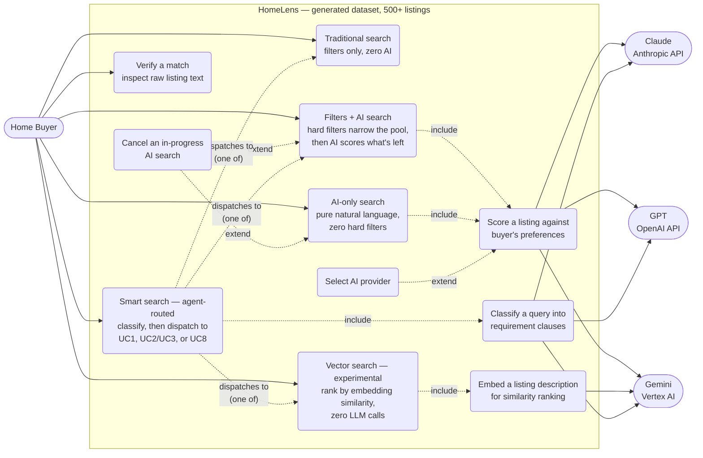
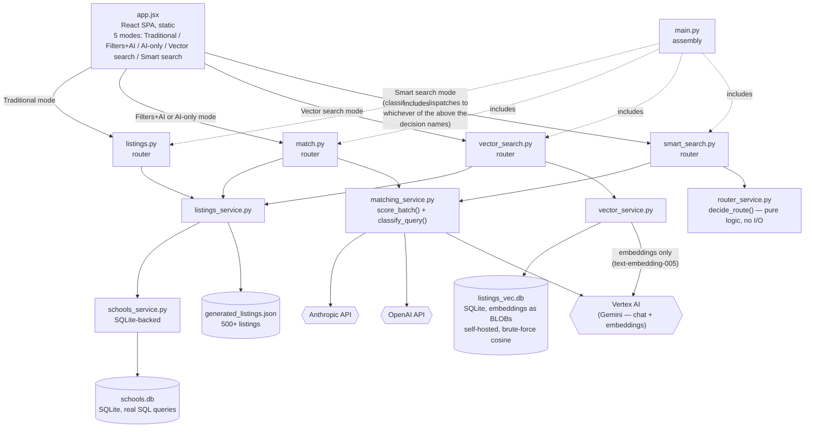
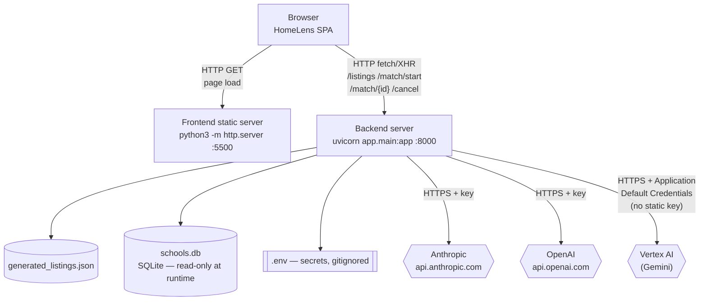
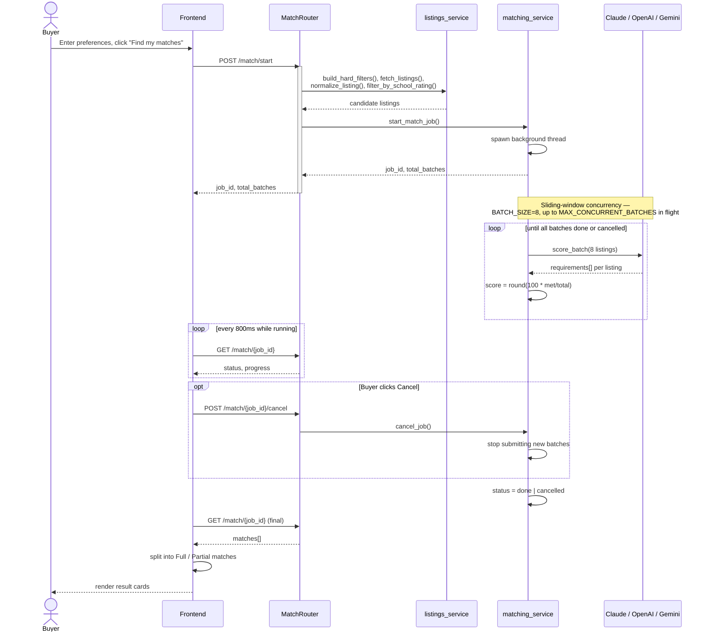
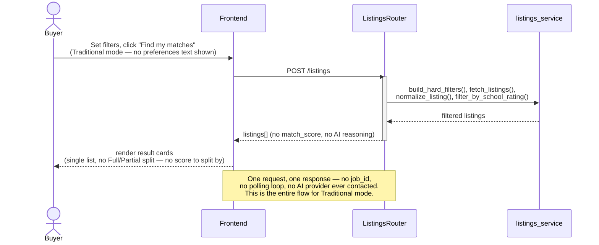
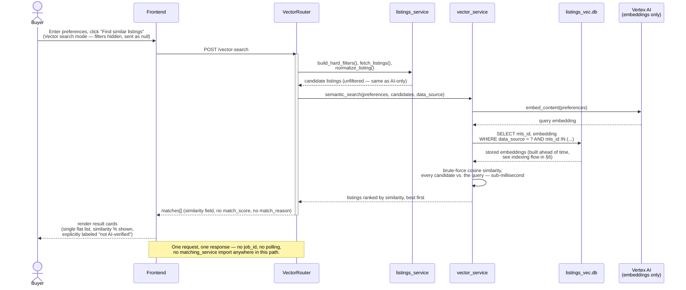
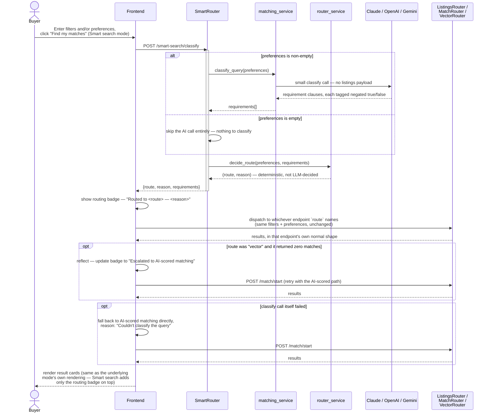
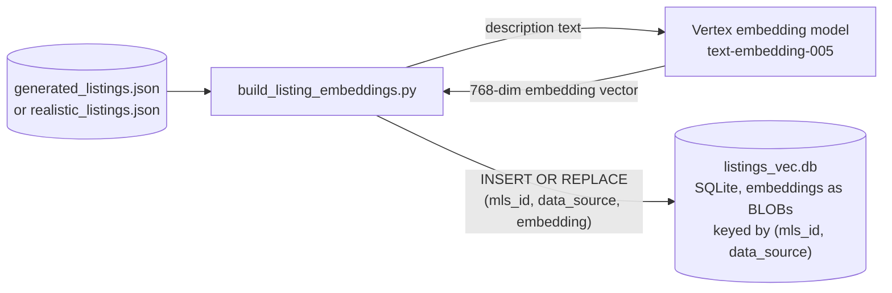
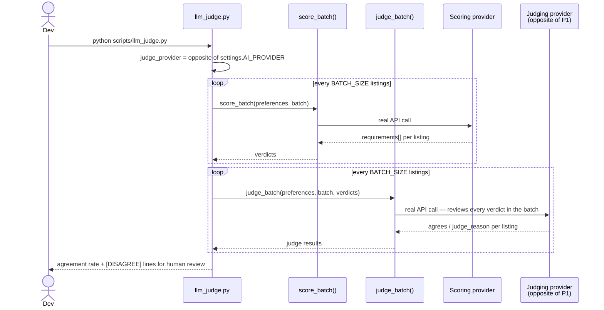

# HomeLens — Architecture

**Scope:** the SQLite variant — school ratings live in a real SQLite
database (`app/data/schools.db`) rather than a parsed JSON file — running
against the `generated` data source (500+ synthetic listings, Redwood City).

The frontend offers five explicit search modes:
- **Traditional** — hard filters only, zero AI involvement
- **Filters + AI** — hard filters narrow the pool, then AI scores what's left
- **AI only** — pure natural language, zero hard filters
- **Vector search (experimental)** — pure embedding-similarity ranking
  against listing descriptions, zero hard filters, **zero LLM calls at
  all**. A standalone learning/comparison tool sitting alongside the other
  four, not a replacement for any of them — see §6.
- **Smart search (agent-routed)** — filters and/or freeform text, no rules
  enforced on the input. A small LLM call decomposes the text into
  requirements, then deterministic code — not the LLM — picks whichever of
  the other three paths fits, runs it, and shows which one it picked and
  why. See §8.

Diagrams are [Mermaid](https://mermaid.js.org) — render natively on GitHub,
GitLab, and most modern markdown viewers. Standalone `.mmd` files are in
`diagrams/` for [mermaid.live](https://mermaid.live).

---

## 1. Use-Case View

Traditional mode has no relationship to Cancel (UC4): it's a single, quick
synchronous request with no background job to cancel. Only the two
AI-*scoring* modes run as cancellable jobs — Vector search is also a
single synchronous request (no job to cancel), same category as
Traditional, just for a different reason: a brute-force similarity scan
is fast enough (sub-millisecond, verified directly) to need no background
job/polling machinery at all. UC9 (embedding a listing) always goes to
Gemini specifically — Vector search deliberately always uses Vertex's
embedding model regardless of which `AI_PROVIDER` is configured for
scoring, since the point is learning Vertex's own embedding offering.

UC11 (classify a query) goes to whichever provider `AI_PROVIDER` is
currently set to — unlike UC9, there's no reason to pin this to one
provider, since classification is a generic text-decomposition task, not
something specific to Vertex. UC10 itself never directly calls an AI
provider or a chat/completion model beyond that one small classify call
— the actual search work is entirely delegated to whichever of UC1/UC2/
UC3/UC8 the deterministic routing rule picks; UC10's diagram edges to
UC2/UC3 are drawn as a single dispatch to UC2 for brevity (UC2 and UC3
are the same underlying `/match` flow, differing only in whether filters
are present — see §8).

---

## 2. Logical View

The two AI-*scoring* modes route through the same `MatchRouter`, differing
only in which filter values get sent — AI-only always sends every filter
as `null`. Vector search reuses that same "send every filter as `null`"
treatment but goes through its own dedicated `VectorRouter` → `VectorService`,
never `MatchingService` — structurally, it cannot call Claude, GPT, or
Gemini's chat models, only Gemini's embedding model, and it does so
regardless of whatever `AI_PROVIDER` is configured for scoring.
`ListingsRouter` never imports `matching_service` either, so Traditional
mode structurally cannot contact any AI provider at all.

`SmartRouter` is deliberately thin and side-effect-free beyond its one
small classify call: it calls `MatchingService.classify_query()` (a new,
much smaller sibling of `score_batch()` — same provider dispatch, same
error handling, no listings payload) and `RouterService.decide_route()`
(pure Python, no I/O, no provider awareness), then returns the decision.
It never imports `ListingsService`, `VectorService`, or runs `/match`
itself — the actual search always happens through whichever of
`ListingsRouter`/`MatchRouter`/`VectorRouter` the frontend calls next,
based on the decision. This keeps `SmartRouter`'s own cost bounded to
always just the one small classify call, and keeps the three existing
search paths completely unmodified — Smart search is purely additive.

---

## 3. Physical View

---

## 4a. Sequence Diagram — Filters + AI / AI-only Search

Both AI-using modes share this exact flow — they differ only in which
filter values are sent (AI-only always sends every filter as `null`).

## 4b. Sequence Diagram — Traditional Search

Synchronous, no background job, no AI provider contacted at all.

## 4c. Sequence Diagram — Vector Search (experimental)

Synchronous like Traditional (no background job — a brute-force
similarity scan over hundreds of listings is sub-millisecond work,
verified directly against this app's own listings, so there's nothing
slow enough here to need `/match/*`'s job/polling machinery). Filters are
always sent as `null`, same treatment as AI-only, for the cleanest
possible "embedding similarity vs. AI reasoning" comparison on the same
query. No LLM call anywhere in this path — only Gemini's *embedding*
model, never a chat/completion model.

## 4d. Sequence Diagram — Smart Search (agent-routed)

Two round trips to the backend, not one: a small, fast classify call
first, then a normal call to whichever of the other 3 endpoints the
decision names — the frontend, not the backend, does the dispatching, so
each existing endpoint's own flow (§4a/§4b/§4c) runs completely unchanged.

---

## 5. Security View

```mermaid
flowchart LR
    subgraph Untrusted["Untrusted zone"]
        Browser["Browser / SPA"]
    end

    subgraph Trusted["Trusted zone — server process"]
        API["FastAPI app"]
        Validators["Pydantic validators"]
        Secrets[".env secrets"]
        Jobs["In-memory job registry"]
    end

    subgraph External["External trusted providers"]
        Anthropic{{"Anthropic API"}}
        OpenAI{{"OpenAI API"}}
        Vertex{{"Vertex AI<br/>(Gemini)"}}
    end

    Browser -->|HTTP| API
    API --> Validators
    API --> Secrets
    API --> Jobs
    API -->|"HTTPS + key<br/>(Filters+AI / AI-only modes only)"| Anthropic
    API -->|"HTTPS + key<br/>(Filters+AI / AI-only modes only)"| OpenAI
    API -->|"HTTPS + ADC, no static key<br/>(Filters+AI / AI-only, and<br/>Vector search — embeddings only)"| Vertex

    style Untrusted fill:#2a0f0f,stroke:#CC0000,stroke-width:2px
    style Trusted fill:#0f2412,stroke:#007700,stroke-width:2px
    style External fill:#1e1e1e,stroke:#888888,stroke-width:2px
```

| # | Finding | Current state |
|---|---|---|
| 1 | No authentication on any endpoint | Zero auth code anywhere in `app/routers/` — anyone reaching the port can trigger real AI API costs or poll/cancel any job by guessing its UUID |
| 2 | CORS defaults to `*` | `CORS_ALLOW_ORIGINS` in `config.py` — any website's JS could call this API from a visitor's browser unless set explicitly |
| 3 | A secret in frontend code is not a real barrier | General principle — anyone can view it via browser DevTools and replay requests directly, bypassing the UI entirely |
| 4 | Secrets handling | `.env` gitignored, never returned in responses, never logged (only usage counts) — applies to `ANTHROPIC_API_KEY`/`OPENAI_API_KEY` specifically; Vertex AI has no equivalent static secret to leak in the first place (see #9) |
| 5 | Input validation | Every field validated by Pydantic (type, enum membership) — invalid input gets a clean 422 |
| 6 | Data sensitivity | Entirely synthetic — fictional addresses, fictional school names/ratings, no real PII |
| 7 | `schools.db` is committed to the repo | Synthetic, non-sensitive reference data, same category as `generated_listings.json` |
| 8 | Traditional mode has a stronger privacy profile | Never contacts Anthropic, OpenAI, or Vertex AI — structurally guaranteed, since `ListingsRouter` never imports `matching_service` |
| 9 | Vertex AI's auth model has no static secret at all | Authenticates via Google Cloud's Application Default Credentials (local `gcloud auth application-default login`, or the Cloud Run service's own identity in production) — nothing resembling `ANTHROPIC_API_KEY`/`OPENAI_API_KEY` exists for this provider, so there's no equivalent key to leak, rotate, or accidentally commit |
| 10 | Vector search has an even narrower reach than the other AI-using modes | `VectorRouter` never imports `matching_service` — structurally cannot contact Anthropic or OpenAI at all, in either direction, regardless of `AI_PROVIDER`. Its only external call is Gemini's embedding model — never a chat/completion model, never sees or acts on anything resembling a prompt-injection surface the way `match_reason` generation does |
| 11 | Smart search's classify step reaches the same 3 providers as scoring | `SmartRouter` imports `matching_service`, so it carries the same reach/cost profile as `MatchRouter` — no new external surface, just a smaller, cheaper call (no listings payload). It never imports `vector_service` or runs a search itself — routing is a decision only, execution always happens through the existing routers above, unchanged |

---

## 6. Vector Search (experimental) — self-hosted semantic search

**Implemented**, as a standalone 4th search mode — not the pre-filter
design originally sketched in this section. That earlier idea (narrow the
candidate pool by similarity *before* still sending it to the LLM,
invisibly, inside the existing Filters+AI/AI-only pipeline) is
superseded by what's below. The goal that actually drove this build was
different: a **hands-on learning exercise** with Vertex's embedding model
and vector similarity search, built so it's **directly, visibly
comparable** to the AI-scored modes on the exact same query in the exact
same UI — not an invisible backend optimization a user would never
notice either way.

### Why self-hosted, not a managed vector database

Real numbers, not a guess: a deployed Vertex AI Vector Search index
endpoint (the managed ANN service Google offers) bills **continuously by
node-hour, regardless of query volume** — a real example found while
evaluating this, a 10,000-record deployment running **~$547.50/month**,
with no pay-as-you-go option. At this app's scale (hundreds of listings,
used interactively, not production query volume), that always-on cost
buys nothing a brute-force scan doesn't already give for free — a full
cosine-similarity scan over hundreds of rows was measured directly
against this app's own listing data at **sub-millisecond**. The managed
service's real value is sub-linear search time at massive scale
(millions of vectors); this project doesn't have that scale, so it gets
none of that benefit while still paying the always-on cost.

So: Vertex's *embedding model* is used (to actually learn it, and because
it's genuinely cheap, pay-per-call), but the *vectors themselves* are
stored as plain BLOBs in an ordinary SQLite table
(`app/data/listings_vec.db`), and searched with brute-force cosine
similarity in Python — no `sqlite-vec` or any other vector-index
extension. (`sqlite-vec` was tried first, since it's the closer match to
what this section originally proposed — it requires SQLite's loadable-extension
support, which every local Python build on the development machine used
for this work lacked. Rather than fight that, the plain-BLOB approach was
used instead — functionally equivalent at this scale, since a full scan
over hundreds of rows costs nothing meaningful either way.)

### Indexing — built once, ahead of time, not per-request

Run manually (`python scripts/build_listing_embeddings.py --data-source
generated`), same manual-trigger philosophy as `seed_schools_db.py` —
embedding calls cost real (if tiny) money, so building the index is a
deliberate, visible action, never triggered automatically on app startup.
Re-running for the same `data_source` overwrites existing rows rather
than accumulating duplicates. Only `realistic`/`generated` are supported
— `live` is SimplyRETS' external, dynamic sandbox data, not ours to
pre-index.

### Query time — see §4c for the full sequence diagram

One synchronous request (`POST /vector-search`), no job/polling — the
similarity scan is fast enough to need none of `/match/*`'s background-job
machinery. `app/services/vector_service.py` embeds the buyer's query,
loads whichever stored embeddings match the request's listings and
`data_source`, computes cosine similarity against each, returns the
listings ranked best-first with a `similarity` field attached. No
`matching_service` import anywhere in this path — structurally the same
"cannot reach an LLM" guarantee Traditional mode already has, just for a
different reason (this mode's entire point is being an independent
comparison point, so it must never accidentally call one).

### What this is actually for, and its known real limitation

A visible, hands-on comparison against AI-only mode on the same query —
not a production ranking feature. Verified live, not assumed: querying
"definitely not a ranch-style home" against the real `generated` dataset
returns an actual Ranch-style listing as the #2 result by similarity — a
real, reproduced instance of a well-known embedding weakness (negation:
"not X" and "X" share nearly all their vocabulary, so cosine similarity
barely distinguishes them). Confirmed the same failure mode independently
on a second, unrelated dataset (fictional school descriptions) before
building this — not a one-off fluke. This is expected, not a bug, and is
exactly the kind of divergence from AI-only mode's reasoning that makes
this comparison useful to look at, not a reason to hide the mode.

---

## 7. LLM-as-judge Accuracy Check

`scripts/llm_judge.py` has one AI provider review another provider's real
`score_batch()` verdicts — never part of the live app, nothing in
`app/routers/` or `app/main.py` touches it. Manual dev tool, same
category as `analyze_scores.py` and `verify_test_cases.py`.

**Why this exists, and its real limit.** `verify_test_cases.py`'s Tier 3
already gives real ground truth — every expected answer hand-verified
against the actual text of 14 fixed listings. Its limit is scale, not
method: hand-verifying more than 14 listings across more than 3 narrow
dimensions isn't something to do by hand for every query. A judge model
is not a replacement for that ground truth and isn't inherently more
trustworthy than the model being judged — if scorer and judge share the
same blind spot, they'll agree confidently while both being wrong, and
the judge gives zero signal in that case. What it's actually good for is
**triage**: a shortlist of exactly which verdicts a second model
disagreed with, worth a human look. A disagreement is a prioritization
signal, not proof of an error — a human still makes the final call.

### How it runs

### Provider selection

`AI_PROVIDER` in `.env` picks which provider does the real scoring, same
as it always has. The judge picks whichever provider ISN'T the one doing
the scoring — with three providers now, not the original two, that needs
an explicit tie-break rule rather than a simple swap: fixed preference
order (anthropic, then openai, then vertex), first one that isn't the
scoring provider. `anthropic` scored → `openai` judges (same as the
original two-provider behavior); `vertex` scored → `anthropic` judges
(deterministic, not incidental). Chosen automatically, never something
configured separately. Whatever the judge provider turns out to be needs
its credentials available — `ANTHROPIC_API_KEY`/`OPENAI_API_KEY` in
`.env` for those two, or working Application Default Credentials plus
`GCP_PROJECT_ID` for Vertex; a missing credential is reported before any
call is made, not partway through a run.

### Batching

Judging happens in the same `BATCH_SIZE`-sized batches scoring already
uses — one judge API call reviews up to 8 listings and returns one
`{mls_id, agrees, judge_reason}` object per listing, the same
per-listing attribution `score_batch` already uses for a shared batch
call. Judging N listings costs `ceil(N/8)` calls, not N.

### Cost, in real call counts

| Scope | Scoring calls | Judge calls | Total |
|---|---|---|---|
| Default — same 14 listings + 3 queries Tier 3 uses | 6 | 6 | **12** |
| `--full-sweep` against `generated` (500 listings), 1 query | 63 | 63 | **126** |
| `--full-sweep --sample 50`, 1 query | 7 | 7 | **14** |

For an exact dollar figure: run with `DEBUG_MODE=true` to log real token
usage, then apply your provider's published per-token rate.

### Every verdict shows real evidence, not a summary

Every `[AGREE]`/`[DISAGREE]` line prints the itemized
`requirement text: MET/NOT MET` breakdown directly underneath, not just
either model's one-sentence account of itself — a summary alone isn't
independently verifiable, the itemized breakdown is. Every run also
writes `scripts/llm_judge_output.csv` (gitignored, regenerated fresh each
run) — every listing, every query, the real description, the full
requirements breakdown, and the judge's verdict, in one row each.

### Feedback loop — `--review`

Few-shot learning from your corrections, not training — no model weights
change for either provider. When `--review` is passed, every `[DISAGREE]`
prompts interactively — `[j] judge was right / [s] scorer was right /
[b] both wrong / [enter] skip`, plus an optional one-line lesson — and
the answer saves to `scripts/judge_feedback.json` immediately. On every
subsequent run (with or without `--review` — the flag only controls
whether new corrections get collected *this* run), the most recent
corrections (capped at `MAX_FEW_SHOT_EXAMPLES = 8`) get folded into the
judge's prompt as worked examples.

`--review` is opt-in because it blocks on `stdin` after every
disagreement — wrong for an unattended or scripted run.

**What this deliberately does not promise:** there's no version of this
where a model self-corrects to zero errors without a human ever checking
in, and the loop itself depends on that review happening. What
realistically improves is the *frequency* of disagreements needing
attention, not the review disappearing.

`--spot-check-agrees N` pulls every Nth `[AGREE]` into the same
interactive review as a real disagreement — agreement between scorer and
judge is not proof either is correct, since a shared blind spot produces
confident agreement while both are wrong, and a disagreement-only review
structurally can never catch that. Off by default; only takes effect
together with `--review`.

---

## 8. Smart Search (agent-routed) — a simplified deep-agent pattern

**Implemented**, as a 5th, standalone search mode. The goal: let a user
give filters and/or freeform text with no rules enforced, and have the
app itself decide which of the other 3 execution paths (Traditional,
AI-scored matching, Vector search) actually handles the query — then run
it and show which path was taken and why. Nothing about the other 4 modes
changes; Smart search calls the exact same endpoints they already call,
adding only a classification step in front and a dispatch decision.

### Why "simplified deep agent," specifically

The deep-agent pattern (as implemented by e.g. LangChain's `deepagents`,
and structurally how Claude Code itself works) has four ingredients:
**explicit planning** (externalize a plan as structured state, revise it
as you learn more), **sub-agent delegation** (isolate sub-tasks in their
own context windows), **a scratchpad/filesystem** (carry state past what
fits in one context window), and **a detailed system prompt** (strategy
as much as tooling). That combination exists to solve long-horizon tasks
that don't fit in one context window and need revision as they go.

A single HomeLens search doesn't have that problem — it fits comfortably
in one context window, and there are only 3 possible destinations to pick
from. So Smart search deliberately keeps only the two ingredients that
still earn their cost here, and skips the two that would be solving a
problem this app doesn't have:

- **Kept — explicit plan.** `matching_service.classify_query()` really
  decomposes the query into typed requirement clauses (reusing
  `SYSTEM_PROMPT`'s own decomposition rule), not a single "vibe" judgment
  — the same "quiet cul-de-sac, near Caltrain, and away from the highway
  = three requirements" rule scoring already uses. This plan is returned
  as real structured data (`requirements: [{text, negated}]`), not
  hidden — see the routing badge below.
- **Kept — reflect-and-revise.** If the Vector search path comes back
  with zero matches, the frontend escalates once to AI-scored matching
  and re-runs, updating the shown reason. One revision, triggered on an
  unambiguous signal (zero results) — not an open-ended retry loop.
- **Skipped — sub-agent delegation.** There's nothing here big enough to
  need context isolation — one query, one classify call, one dispatch.
  Splitting that across sub-agents would add coordination overhead for a
  decision that fits in a few hundred tokens.
- **Skipped — a scratchpad/filesystem.** No state needs to survive past
  what a single request/response already carries — the routing decision
  is returned once, consumed once, done.

### The routing decision is deterministic code, not the LLM's call

Same philosophy `matching_service._compute_deterministic_scores` already
uses for scoring: the model extracts/observes (here, decomposes the query
and flags negation), and plain Python — `router_service.decide_route()`
— makes the actual decision from that. This is what keeps the rule
inspectable and testable rather than a black box that might route
differently for the same input on a different day:

- No `preferences` text at all → **Traditional** — nothing to reason
  about.
- Exactly one requirement, not negated → **Vector search** — cheap, and
  precisely the case vector search is good at (see §6's own measured
  negation/compound-query weaknesses — this rule exists specifically to
  route *around* them).
- Multiple requirements and/or any negated → **AI-scored matching** —
  more expensive, used specifically where vector search's known
  weaknesses would otherwise bite.

### Showing the decision, not hiding it

Same pattern the vector-search eval dashboard and `llm_judge.py` already
follow — surface *why*, not just a result. The `/smart-search/classify`
response carries `{route, reason, requirements}` as real structured data;
the frontend renders it as a badge above the results ("Routed to Vector
search — 1 requirement detected, no negation"), and the backend logs one
line per decision (`[smart-search] route=... reason=...`) for whoever's
tuning the classifier.

### What's deliberately unmeasured, and left that way for now

The reflect step escalates only on **zero** vector-search matches, not a
low-similarity threshold — there's no measured similarity-score
distribution yet to justify a specific numeric cutoff, and this project's
own norm all along has been to measure a threshold from real data before
setting it (`SCORE_THRESHOLD` via `scripts/analyze_scores.py`,
`MAX_CONCURRENT_BATCHES` via observed rate-limit headers). A future
refinement could add a measured low-similarity escalation trigger the
same way, once someone runs that analysis for vector search's similarity
scores specifically — v1 ships with only the unambiguous, unguessed
signal.
